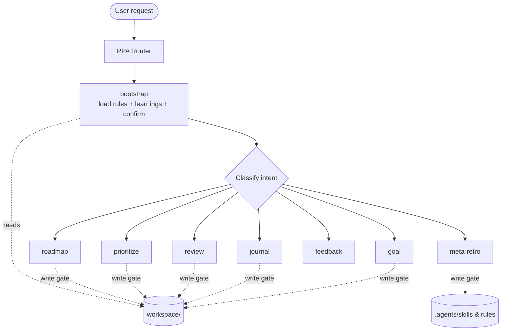

# Personal Performance Assistant (PPA)

> ⚠️ **WARNING:** This repository is a work in progress. Use at your own risk. Do not commit sensitive data.


A lightweight framework for managing SMART goals, maintaining a personal profile, and keeping a structured logbook with guided reflections. Designed for seamless use with AI agents in VS Code or Antigravity.

## Quick Start (VS Code)

1. Clone the repository:

```
git clone <repo-url>
cd personal-performance-assistant
code .
```
2. Open the folder in VS Code.

3. Toggle your AI chat/assistant integration (for example Copilot Chat or another AI extension).

4. Select the **PPA** agent (the thin router) and describe what you want to do — set a goal, log progress, review your week, prioritize, plan, or reflect. The router loads your context and delegates to the right skill.

## Architecture

PPA uses a **thin router, rich skill** design consolidated under `.agents/`:

- **Router & Coach** (`.agents/skills/ppa/SKILL.md`): routes actionable requests to skills AND spars as a read-only coaching partner. Its Step 1 bootstrap loads rules and learnings, then confirms your data.
- **Skills** (`.agents/skills/`): each owns one modular capability via a `SKILL.md`.
- **Hard rules** (`.agents/AGENTS.md`): binding rules including the **write gate** (no `workspace/` file changes without explicit confirmation), Dutch as default language, AI disclaimer, mandatory retro, and RISEN engineering principles.
- **Learnings** (`.agents/learnings.md`): persistent behavioral lessons accumulated across sessions.
- **Data** (`workspace/`): your local Dutch markdown files are the single source of truth.

### Skills

| Skill | Purpose |
| :--- | :--- |
| `ppa` | Strategic router & sparring partner for open-ended thinking. |
| `goal` | Turns a fuzzy wish into a concrete objective (SMART/OKR). |
| `journal` | Logs progress, obstacles, and guides structured reflections. |
| `review` | Week/period review across goals with stagnation detection. |
| `prioritize` | Applies the 5/25 rule to keep focus on Top 3. |
| `roadmap` | Quarterly themed timeline of your goals and milestones. |
| `feedback` | Structures clear, honest feedback using the "Ruimte Teruggeven" pattern. |
| `meta-retro` | Improves the PPA assistant itself and logs behavioral learnings. |

## Workflow



## Templates & Workspace

The PPA uses a clear distinction between **Templates** (blueprints inside skills) and **Workspace** (your data):

- **Templates** (`.agents/skills/<skill>/`): Structural starting points and templates that skills use to format files.
- **Workspace** (`workspace/`): This is where your personal data lives.
    - `profiel.md` & `rolbeschrijving.md`: Your profile and role description.
    - `doelen.md`: Your active Top 3 goals, avoid list, and next actions.
    - `logboek/`: Your chronological monthly reflection logs.
    - `gap-analyse.md`: Your gap analysis.
    - *Note: Do not commit sensitive data in this folder.*

## Structure

- `.agents/AGENTS.md` — Hard rules (write gate, language, disclaimer, retro, RISEN principles).
- `.agents/learnings.md` — Persistent behavioral lessons accumulated across sessions.
- `.agents/skills/` — Modular skills (`ppa`, `goal`, `journal`, `review`, `prioritize`, `roadmap`, `feedback`, `meta-retro`).
- `.agents/scripts/` — Helper scripts (e.g., `Backup-Workspace.ps1`).
- `workspace/` — Your personal Markdown documents (DO NOT COMMIT SENSITIVE DATA).
- `CHANGELOG.md` — Project changelog.
- `README.md` — This file.

## Links

### Agent Skills
- [VsCode Agent Skills](https://code.visualstudio.com/docs/copilot/customization/agent-skills)
- [Antigravity Agent Skills](https://antigravity.google/docs/skills)
- [AgentSkills.io](https://agentskills.io/home)

## Roadmap

- refactor constitution for other agents (e.g., Reflection Guide, Goal Evaluator)
- add development plan to profile template

    ```markdown
    ## Development Plan 

    ### Short term (1–3 months)
    [Skills, tools and certifications to acquire.]

    ### Mid term (3–12 months)
    [Career evolution and leadership/governance goals.]

    ### Long term (greater than 1 year)
    [Career evolution and leadership/governance goals.]
    ```

