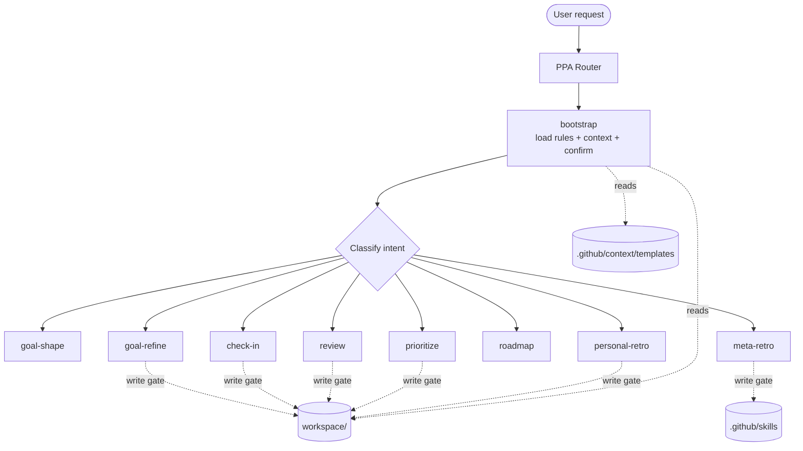

# Personal Performance Assistant (PPA)

> ⚠️ **WARNING:** This repository is a work in progress. Use at your own risk. Do not commit sensitive data.


A lightweight framework for managing SMART goals, maintaining a personal profile, and keeping a structured logbook with guided reflections. Designed for seamless use with AI agents in VS Code or Antigravity.

## Quick Start (VS Code)

1. Clone the repository:

```
git clone <repo-url>
cd personal-performance-assistant
code .
```
2. Open the folder in VS Code.

3. Toggle your AI chat/assistant integration (for example Copilot Chat or another AI extension).

4. Select the **PPA** agent (the thin router) and describe what you want to do — set a goal, log progress, review your week, prioritize, plan, or reflect. The router loads your context and delegates to the right skill.

## Architecture

PPA uses a **thin agent, rich skill** design:

- **Agent** (`.github/agents/ppa.agent.md`): routes actionable requests to skills AND spars as a read-only coaching partner. Its Step 1 bootstrap loads the rules and shared context, then confirms your data.
- **Skills** (`.github/skills/`): each owns one capability via a `SKILL.md`.
- **Shared context** (`.github/context/`): frameworks, cadence, role, data-schema, write-procedure, templates and helpers shared across skills. Loaded by the agent bootstrap.
- **Hard rules** (`.agent/rules/agent.md`): binding rules including the **write gate** (no `workspace/` file changes without explicit confirmation), Dutch as default language, AI disclaimer, mandatory retro, and engineering principles.
- **Data** (`workspace/`): your local Dutch markdown files are the single source of truth.

### Agent

| Agent | Description |
| :--- | :--- |
| **PPA** | Routes to skills for actionable work; spars read-only as a coaching partner for open-ended thinking. |

### Skills

| Skill | Purpose |
| :--- | :--- |
| `goal-shape` | Turn a vague intention into one sharp candidate goal. |
| `goal-refine` | Refine a goal into SMART/OKR and record it (behind the write gate). |
| `check-in` | Log progress on the Top 3 into the journal. |
| `review` | Week/period review with stagnation detection. |
| `prioritize` | 5/25 focus — keep a Top 3, park the rest. |
| `roadmap` | Quarterly themed overview of your goals. |
| `personal-retro` | Structured reflection on your own performance. |
| `meta-retro` | Improve the assistant itself. |


## Workflow



## Templates & Workspace

The PPA uses a clear distinction between **Templates** (blueprints) and **Workspace** (your data):

-   **Templates** (`.github/context/templates/`): These are the structural starting points. Agents read these to understand how to format new files.
-   **Workspace** (`workspace/`): This is where your personal data lives.
    -   `profile.md`: Your user profile and context.
    -   `goals.md`: Your active goals.
    -   `logbook.md`: Your daily journal and reflection log.
    -   `gap-analysis.md`: Your gap analysis.
    -   *Note: Do not commit sensitive data in this folder.*


## Structure

- `.github/agents/` — Agent definition: `ppa` (strategic router & coach).
- `.github/skills/` — Rich skills, each with a `SKILL.md` (and optional `assets/`).
- `.github/context/` — Shared frameworks, cadence, role, data-schema, write-procedure, `templates/` and `helpers/`, loaded by the agent bootstrap.
- `.github/copilot-instructions.md` — Architecture and operating principles.
- `.agent/rules/agent.md` — Hard rules (write gate, language, disclaimer, retro, engineering principles).
- `workspace/` — Your personal Markdown documents (DO NOT COMMIT SENSITIVE DATA).
- `CHANGELOG.md` — Frozen historical archive (no longer actively maintained).
- `README.md` — This file.

## Links

### Agent Skills
- [VsCode Agent Skills](https://code.visualstudio.com/docs/copilot/customization/agent-skills)
- [Antigravity Agent Skills](https://antigravity.google/docs/skills)
- [AgentSkills.io](https://agentskills.io/home)

## Roadmap

- refactor constitution for other agents (e.g., Reflection Guide, Goal Evaluator)
- add development plan to profile template

    ```markdown
    ## Development Plan 

    ### Short term (1–3 months)
    [Skills, tools and certifications to acquire.]

    ### Mid term (3–12 months)
    [Career evolution and leadership/governance goals.]

    ### Long term (greater than 1 year)
    [Career evolution and leadership/governance goals.]
    ```

