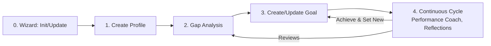

# Personal Performance Assistant (PPA)

> ⚠️ **WARNING:** This repository is a work in progress. Use at your own risk. Do not commit sensitive data.


A lightweight framework for managing SMART goals, maintaining a personal profile, and keeping a structured logbook with guided reflections. Designed for seamless use with AI agents in VS Code or Antigravity.

## Quick Start (VS Code)

1. Clone the repository:

```
git clone <repo-url>
cd personal-performance-assistant
code .
```
2. Open the folder in VS Code.

3. Toggle your AI chat/assistant integration (for example Copilot Chat or another AI extension).

4. In the chat input, type the command (e.g. `/ppa-wizard`) or prompt.

This will run the initialization prompt which helps set up or update the assistant guidelines and apply templates to your workspace files.

## Available Agents

| Slash Command | Description |
| :--- | :--- |
| `/Career Coach` | Expert in personal branding and profile optimization. |
| `/Gap Analysis` | An agent that performs gap analyses to identify discrepancies between current and desired states. |
| `/Goal Setter` | An agent that helps formulate and refine SMART goals. |
| `/Performance Goal Setter` | Helps formulate and refine SMART goals. |
| `/Performance Coach` | Partner for professional growth, focus, and reflection. |
| `/PPA Wizard` | Initializes and updates personal assistant workspaces. |
| `/Simple Goals Setter` | A 3-step goal setting agent using the "List, Circle, Eliminate" method. |
| `/Simple Goals Coach` | Strategic prioritization coach using the 3-step method. |

## Simple flow



## Usage

- Use the slash commands (e.g. `/ppa-wizard`) to interact with specific agents.
- **Wizard (`/ppa-wizard`)**: Run this to Initialize a new workspace OR Update an existing one (includes backup functionality).

## Structure

- `.agent/workflows/` — Agent workflows and prompts.
- `.agent/rules/` — Specific rules for agents (e.g., Gap Analysis).
- `.github/agents/` — Source of truth for agent definitions.
- `.ppa/` — Assistant guidelines and templates.
    - `templates/` — Markdown templates for profiles, goals, etc.
    - `helpers/` — Maintenance scripts (backup, sync).
- `workspace/` — Your personal Markdown documents (DO NOT COMMIT SENSITIVE DATA).
- `README.md` — This file.


## Roadmap

- refactor constitution for other agents (e.g., Reflection Guide, Goal Evaluator)
- add development plan to profile template

    ```markdown
    ## Development Plan 

    ### Short term (1–3 months)
    [Skills, tools and certifications to acquire.]

    ### Mid term (3–12 months)
    [Career evolution and leadership/governance goals.]

    ### Long term (greater than 1 year)
    [Career evolution and leadership/governance goals.]
    ```

