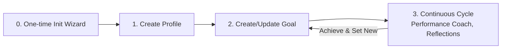

# Personal Performance Assistant (PPA)

> ⚠️ **WARNING:** This repository is a work in progress. Use at your own risk. Do not commit sensitive data.


A lightweight framework for managing SMART goals, maintaining a personal profile, and keeping a structured logbook with guided reflections. Designed for seamless use with AI agents in VS Code or Antigravity.

## Quick Start (VS Code)

1. Clone the repository:

```
git clone <repo-url>
cd personal-performance-assistant
code .
```
2. Open the folder in VS Code.

3. Toggle your AI chat/assistant integration (for example Copilot Chat or another AI extension).

4. In the chat input, type the command (e.g. `/ppa-wizard` or `/) or prompt.

This will run the initialization prompt which helps set up or update the assistant guidelines and apply templates to your workspace files.

## Structure

- .agent/workflows/ — agent workflows
- .github/prompts/ — conversational prompts for the assistant
- .ppa/ — assistant guidelines and templates
- workspace/ — your personal Markdown documents (DO NOT COMMIT SENSITIVE DATA)
- README.md — this file

## Development

The agent definitions are maintained in `.github/agents`. To propagate changes to the `.agent/workflows` directory (used by the agent), run the sync script:

**Windows (PowerShell):**
```powershell
.ppa/helpers/sync-agents.ps1
```

**Linux/Mac (Bash):**
```bash
./.ppa/helpers/sync-agents.sh
```

## Usage

- Use the prompts in `.github/prompts/` or `.agent/workflows/` via your AI chat to create or update files under `workspace/` using templates.


## Simple flow



## Contributing

Fork → branch → PR. Keep changes small and document template or guideline updates.

## Roadmap

- refactor constitution for other agents (e.g., Reflection Guide, Goal Evaluator)
- add development plan to profile template

    ```markdown
    ## Development Plan 

    ### Short term (1–3 months)
    [Skills, tools and certifications to acquire.]

    ### Mid term (3–12 months)
    [Career evolution and leadership/governance goals.]

    ### Long term (greater than 1 year)
    [Career evolution and leadership/governance goals.]
    ```

